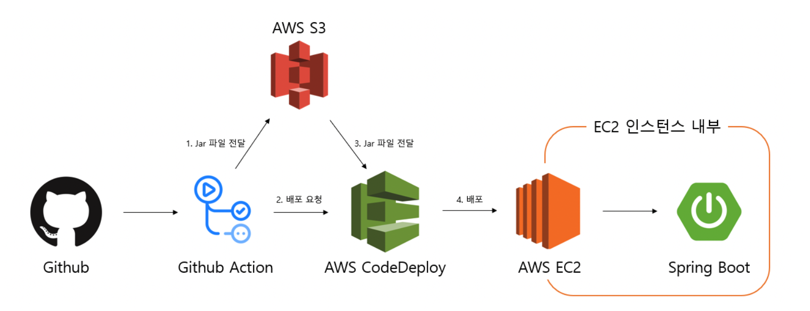

# issue-tracker

2025 마스터즈 팀 프로젝트 이슈 트래커
텍스트

  

<!--

-->

    💡<a href="https://flint-baritone-8be.notion.site/Issue-Tracker-1ec75c9287fa8069bca8c520db98204f?pvs=4" target="_blank">팀 노션</a>  

  

## 👋🏻 Team03

|                    [MUD](https://github.com/jang-jinuk)                     |                 [JOHNNIE](https://github.com/dongchan0105)                  |                     [MILO](https://github.com/y-minion)                     |
| :-------------------------------------------------------------------------: | :-------------------------------------------------------------------------: | :-------------------------------------------------------------------------: |
|  |  |  |
|                                   Backend                                   |                                   Backend                                   |                                  Frontend                                   |
|                          보령머드 축제 놀러오세요                           |                              모든 소년 소녀들                               |                           퉁 퉁 퉁 퉁 퉁 사후르~                            |

  

## ⚒️ TechStack

### Front-End

- HTML
- CSS
- JavaScript
- React
- Zustand + Immer
- React-router-dom
- Vite

### Back-End

- Java
- SpringBoot
- Spring Data JDBC
- MySQL
- Oauth2.0

### Infra

- GitHub Actions
- AWS
  - S3
  - EC2
  - CodeDeploy
- Front
  1. GitHub Actions가 React 코드를 npm run build로 정적 파일(dist/)로 만듦

  2. 그 정적 파일을 S3 버킷에 업로드

  3. 사용자는 S3 정적 호스팅 주소 (예: http://your-s3-site.amazonaws.com)로 접속

  4. 브라우저에서 HTML/JS를 로딩하고, API 요청은 리엑트가 EC2 백엔드로 보냄 (http://EC2-IP:8080)

- BackEnd
  1. GitHub Actions가 백엔드 코드를 ./gradlew build로 빌드 → .jar 생성

  2. .jar, appspec.yml, start.sh, stop.sh 등을 묶어 .zip으로 만들어 S3에 업로드

  3. GitHub Actions가 AWS CodeDeploy에 배포 요청 (zip 경로 전달)

  4. CodeDeploy가 EC2 인스턴스에 접속해:

  5. stop.sh: 기존 서버 중단

  6. start.sh: 환경변수 설정하고 java -jar로 Spring Boot 실행

### Communication

- GitHub
- Slack
- Notion

  

